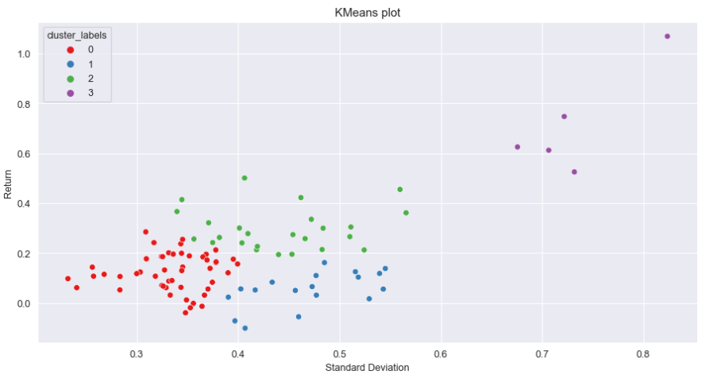

# Clustering stocks with K-Means clustering
Clustering is a powerful technique with many use cases. In the financial industry, it can be used to group equities with similar risk and return characteristics. This can be of great value for investors looking to gain insights to further inform their portfolio allocation and investment decisions. In this project, I randomly sample 100 stocks from the S&P 500 Index. These equities are then clustered using the K-Means algorithm.

**Project Outline:**
* Data Collection
* EDA & Data Cleaning
* Feature Engineering
* K-Means Clustering

**Kmeans Clustering:**

 

